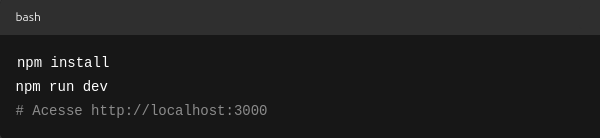

## Contador-Visitas

# 📊 Contador de Visitas

    Este projeto é um contador de visitas desenvolvido com Next.js, ideal para ser integrado em perfis pessoais, como o GitHub, com objetivo de rastrear e exibir o número de acessos.

# 🔧 Tecnologias utilizadas

    Next.js 13 – Framework React para SSR/SSG

    API Routes – Para tratar o contador de forma backend-less

    JSON local (visitas.json) – Usado como "banco de dados" para registrar os acessos

    fetch + useEffect – Para atualizar o número de visitas dinamicamente no frontend

# 📁 Estrutura

    pages/api/visitas.js: Rota API responsável por incrementar e retornar o número de visitas.

    pages/index.js: Página principal onde o contador é exibido.

    visitas.json: Arquivo simples que armazena o número de visitas (persistência local).

# 

# 💡 Observações

    Ideal para projetos pessoais que precisam de um contador leve e simples.

    Não utiliza banco de dados, apenas persistência em arquivo JSON.